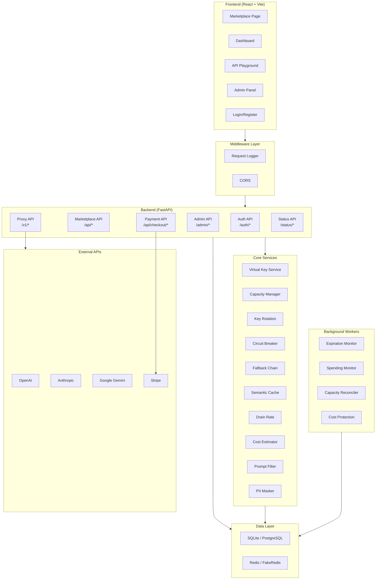
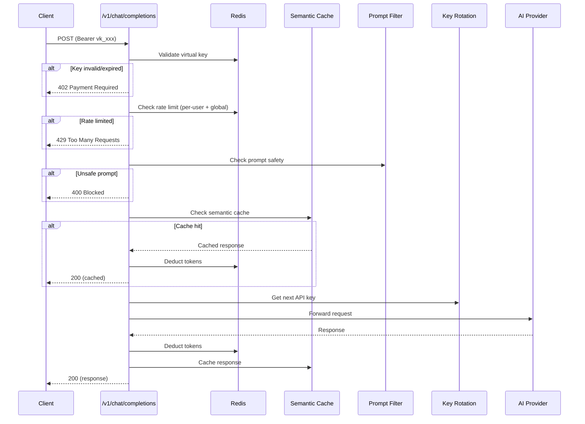

# System Architecture

## High-Level Overview

## Request Flow — API Proxy

## Data Models

```mermaid
erDiagram
    User ||--o{ Rental : has
    User ||--o{ Transaction : makes
    Plan ||--o{ Rental : purchased_as
    Rental ||--o{ UsageLog : generates
    User ||--o{ SpendingAlert : triggers

    User {
        int id PK
        string email
        string hashed_password
        enum role
        bool is_active
    }

    Plan {
        int id PK
        string name
        float price
        int duration_minutes
        int token_cap
        int rpm_limit
        float drain_rate_multiplier
    }

    Rental {
        int id PK
        int user_id FK
        int plan_id FK
        string virtual_key
        enum status
        int tokens_used
        int tokens_remaining
        datetime expires_at
    }

    Transaction {
        int id PK
        int user_id FK
        float amount
        string stripe_payment_id
    }

    UsageLog {
        int id PK
        int rental_id FK
        string model
        int tokens_used
        float cost_usd
        bool was_cached
    }
```

## Key Design Decisions

| Decision | Rationale |
|----------|-----------|
| **Virtual keys** instead of forwarding real keys | Users never see actual provider keys; we control access, billing, and revocation |
| **Redis for real-time data** | TTLs, rate counters, token balances — all need sub-ms latency |
| **LiteLLM for multi-provider** | Single API interface for OpenAI, Anthropic, Google — simplifies fallback and rotation |
| **Hybrid capacity reservation** | Hard-reserve RPM, soft-reserve tokens with 1.5x overbooking — balances availability vs revenue |
| **Per-model drain rates** | GPT-4o costs 10x more than Gemini Flash — drain tokens proportionally to actual cost |
| **Stripe webhooks for payment** | Rental created ONLY after payment confirmed — prevents free usage |
